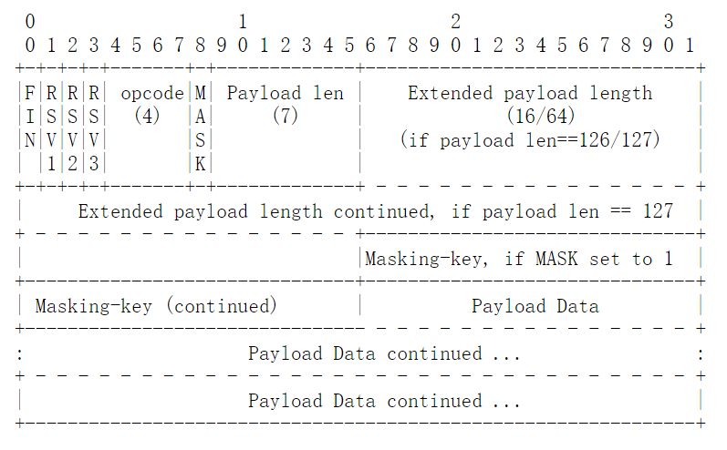

# WebSocket

RFC 6455 定义了 WebSocket 协议， 👉 [这里](https://tools.ietf.org/html/rfc6455)

## 介绍

WebSocket 是基于 TCP 的双工协议，属于应用层。

WebSocket 是基于 frame（帧）的协议，注意和 TCP Stream（流） 协议不同，WebSocket 无需我们管理封包/拆包。每次发送或接收为一次 frame 交互。每条 frame 会自动封包/拆包。这也是 WebSocket 的设计哲学。

一个 frame 格式如下

